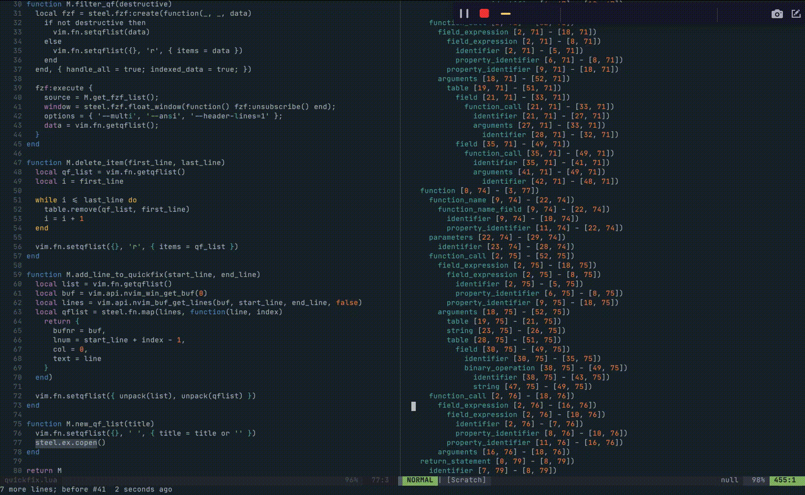

# Neovim Treesitter Playground

View treesitter information directly in Neovim!



## Requirements
  - Neovim [nightly](https://github.com/neovim/neovim#install-from-source)
  - [nvim-treesitter](https://github.com/nvim-treesitter/nvim-treesitter) plugin

## Setup

Install the plugin (vim-plug shown):

```vim
Plug 'nvim-treesitter/nvim-treesitter'
Plug 'nvim-treesitter/playground'
```

It's also recommended that you install the `query` parser for query editor highlighting. Run this after installing the above plugins.

```vim
:TSInstall query
```

The configuration is like any other nvim-treesitter module.

```lua
require "nvim-treesitter.configs".setup {
  playground = {
    enable = true,
    disable = {},
    updatetime = 25, -- Debounced time for highlighting nodes in the playground from source code
    persist_queries = false, -- Whether the query persists across vim sessions
    keybindings = {
      toggle_query_editor = 'o',
      toggle_hl_groups = 'i',
      toggle_injected_languages = 't',
      toggle_anonymous_nodes = 'a',
      toggle_language_display = 'I',
      focus_language = 'f',
      unfocus_language = 'F',
      update = 'R',
      goto_node = '<cr>',
      show_help = '?',
    },
  }
}
```

## Usage

The tree can be toggled using the command `:TSPlaygroundToggle`.

### Keybindings

- `R`: Refreshes the playground view when focused or reloads the query when the query editor is focused.
- `o`: Toggles the query editor when the playground is focused.
- `a`: Toggles visibility of anonymous nodes.
- `i`: Toggles visibility of highlight groups.
- `I`: Toggles visibility of the language the node belongs to.
- `t`: Toggles visibility of injected languages.
- `f`: Focuses the language tree under the cursor in the playground. The query editor will now be using the focused language.
- `F`: Unfocuses the currently focused language.
- `<cr>`: Go to current node in code buffer

## Query Editor

Press `o` to show the query editor.
Write your query like `(node) @capture`,
put the cursor under the capture to highlight the matches.

## Completions

When you are on a `query` buffer, you can get a list of suggestions with
<kbd>Ctrl-X Ctrl-O</kbd>. See `:h 'omnifunc'`.

## Query Linter

The playground can lint query files for you. For that, you need to activate the `query_linter` module:

```lua
require "nvim-treesitter.configs".setup {
  query_linter = {
    enable = true,
    use_virtual_text = true,
    lint_events = {"BufWrite", "CursorHold"},
  },
}
```


## Show treesitter and syntax highlight groups under the cursor 

The playground comes with `:TSHighlightCapturesUnderCursor` that shows any treesitter or syntax highlight groups under the cursor.


